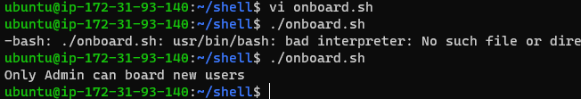
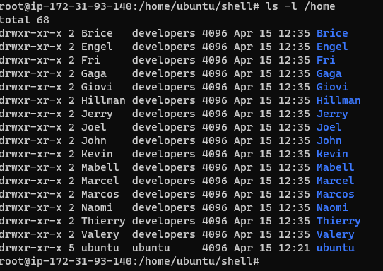

# Auxillary-projects
> Create a project folder, move into the project folder and create some files
```Bash
mkdir Shell
cd shell
touch names.cvs id_rsa id_rsa.pub
```
> input some random names into the names.csv file. Open the id_rsa and id-rsa.pub files and insert the private and public key respectiveli
`vi names.csv`

`vi id_rsa`

`vi id_rsa.pub`

> Create the group Developers where your users will be added to
`groupadd Developers`

> Now write and execute your script

`chmod +x onboard.sh`

`./onboard.sh`

> you should get the following result



> Now change to the root user and execute the file again
`sudo su`
`./onboard.sh`
> you should get the following results



> Test some users to see if they can connect to the server


